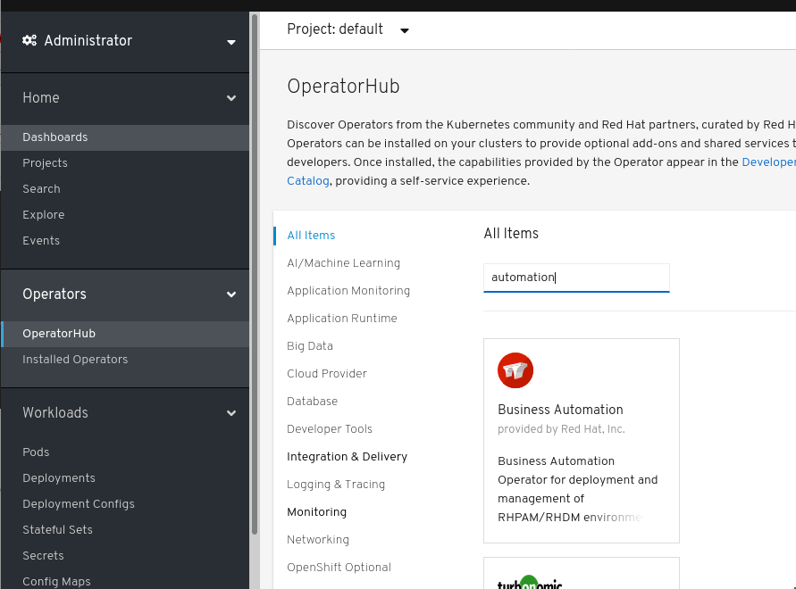
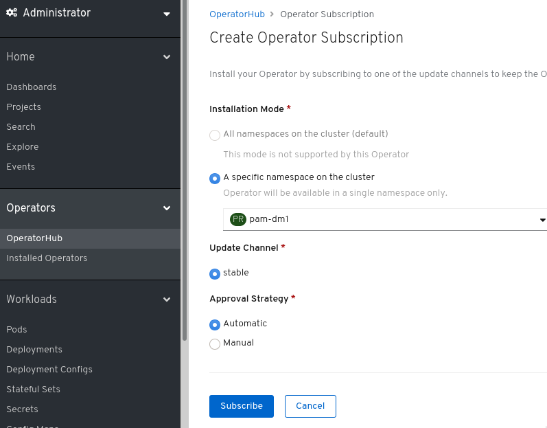
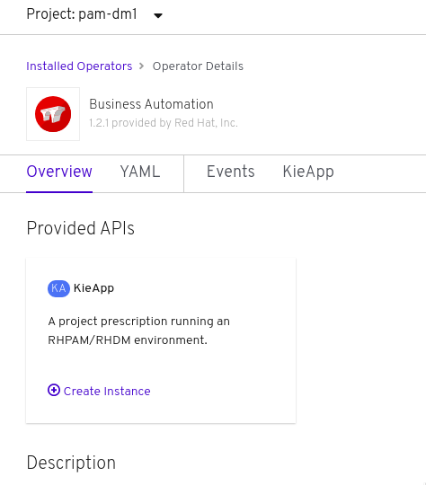
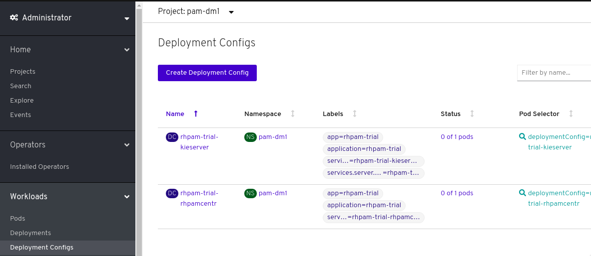

# Install and Configure Decision Manager (DM)

In OpenShift 4.2 the installation of PAM / DM is performed primarily through Operators. This provides a very smooth usage model, where as a user, you can just specify that you want a set of capabilities (e.g. PAM or DM), and the operator that is responsible for those capabilities will provision and configure them. 

1. As a regular user, create a new project from the command line. We will use this project to install all of the PAM/DM components
```bash
[akochnev@localhost quarkus-kieserver-client]$ oc new-project pam-dm1
Now using project "pam-dm1" on server "https://api.ocp-pam-cluster-1.clusters.thinkjitsu.me:6443".

You can add applications to this project with the 'new-app' command. For example, try:

    oc new-app django-psql-example

to build a new example application in Python. Or use kubectl to deploy a simple Kubernetes application:

    kubectl create deployment hello-node --image=gcr.io/hello-minikube-zero-install/hello-node
```

2. As you’re logged in as the Admin user (in one of the browser sessions), navigate to the Operators -> Operator Hub section, and search for Automation in the search box. 



3. Choose the “Business Automation” operator and click on the “Install” button to install the operator. Choose the newly created pam-dm1 project in which the subscription will be created



4. Now hit the subscribe button and keep the default settings


5. Now, log into the Console as the “vzuser1” user and navigate to the “Operators” -> Installed Operators section. If you get an “Unauthorized” error on the page, make sure that the “Project” dropdown at the top left of the page has your new “pam-dm1” project selected. You should see the newly subscribed Business Automation operator. Click into the operator tile, and on the Operator details page, click the “Create Instance” link/button



6. Accept the default values and click the “Create” button to proceed with the creation of the KieApp custom resource. 
```yaml
apiVersion: app.kiegroup.org/v2
kind: KieApp
metadata:
 name: rhpam-trial
 namespace: pam-dm1
spec:
 environment: rhpam-trial
```

The “environment” parameter here is most important - it specifies how the product will be deployed. There are other “environment” values that can be used for production, HA, authoring, etc (e.g. rhpam-trial,  rhpam-authoring, rhpam-authoring-ha, etc)  - more details are available on the OpenShift PAM/DM installation documentation  

7. Now, stop and explore: 
* First click on the blue rhpam-trail KieApp
* Then select the resource tab
* Click through on the new custom Resource and observe the multitude of resources that just got created in the cluster

* Navigate to the Workloads menu and observe what you can see there : Pods, Deployments, and Deployment Configs . Is everything working as you would expect it to ? 
  


-  `STOP : Do not proceed further, spend 5 minutes to try to figure out what is happening here. `

[**NEXT LAB -> DM Operator Troubleshooting**](2_2_Troubleshoot_Operator.md)
