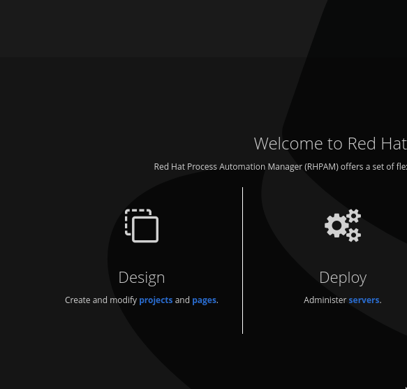
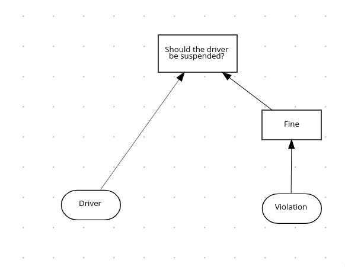

## Create a DMN decision service

Now that we have all of our components up and running, we can use Decision Manager to build a simple service using DMN 

1. Navigate to Networking -> Routes and click through the rhpam-trial-rhpamcentr route. That will take you to the Business Central login screen. Login as : “adminUser” / “RedHat”, then click through to the “Design” section of Business Central



If you ever forget the credentials for Business Central, you can always easily find them by inspecting the rhpam-trial custom resources: 

```yaml

apiVersion: app.kiegroup.org/v2
kind: KieApp
metadata:
 annotations:
   app.kiegroup.org: 1.2.1
 creationTimestamp: '2019-12-11T08:47:49Z'
 generation: 8
 name: rhpam-trial
 namespace: pam-dm1
 resourceVersion: '37323'
 selfLink: /apis/app.kiegroup.org/v2/namespaces/pam-dm1/kieapps/rhpam-trial
 uid: e8d79bc7-1bf2-11ea-a3f0-0a133e3734e8
spec:
 auth: {}
 commonConfig:
   amqPassword: RedHat
   mavenPassword: RedHat
   adminPassword: RedHat
   amqClusterPassword: RedHat
   controllerPassword: RedHat
   dbPassword: RedHat
   adminUser: adminUser
   applicationName: rhpam-trial
   keyStorePassword: RedHat
   serverPassword: RedHat
   imageTag: 7.5.1
 environment: rhpam-trial
 objects:
   console:
     resources: {}
   servers:
     - deployments: 1
       name: rhpam-trial-kieserver
       resources: {}
 upgrades:
   enabled: false
   minor: false
 version: 7.5.1
```

2. Click through on My Space and click on the “Try Samples” button, choose the “Traffic Violation” project and click “OK” to proceed. 


The result of this process is a very simple Decision implemented using DMN, a couple of data objects, and a few test scenarios. For now, we will focus on working with the DMN model. 

2.  Click through the “Traffic Violation” DMN model. This very simple model shows that there are two inputs into the decision - Driver and Violation, and based on the values provided as inputs, there are two decisions being made, both implemented as decision tables. 




3. Play around with the Violation Scenarios and see how TDD is implemented in this space(click the “play” button to see the tests run)


4. Whenever you’re satisfied with the logic of the model, click on the Build button, and then on the Deploy Button. You should see some green success messages indicating that the decision is successfully deployed

5. Now, navigate to the Menu -> Deploy -> Execution servers of Business Central. You will now observer that the Traffic Violation decision is deployed to the kieservers and that it can be started/stopped, etc. 


6. Explore the REST APIs available through the kieserver

This is where the fun begins - you can now interact with the Decision Model that you deployed through the REST APIs available through kieserver


  6.1. Install PostMan if you don’t already have it, we will be using it quite a bit

  6.2. Go back to the OpenShift console, and navigate to Networking -> Routes, and copy the URL of the “rhpam-trial-kieserver” route. Paste it into a new browser window, and append /docs to the end of that URL, e.g: https://rhpam-trial-kieserver-pam-dm1.apps.ocp-pam-cluster-1.clusters.thinkjitsu.me/docs/

  6.3. This opens up the Swagger UI console which allows us to play a little bit with the REST 
APIs. There are many different APIs to explore here, but we will focus on DMN at this time. 
Click on the DMN models section and pick the “GET” request to /server/containers/containerId/dmn . For this request, we will use “traffic-violation_1.0.0-SNAPSHOT” for the “containerId” parameter (which is a concatenation of the Maven artifactId and version) and “application/json” as the content type. The kieserver prompts for authentication (which we will later deal with) and gives back details about the DMN model: 


```j{
  "type": "SUCCESS",
  "msg": "OK models successfully retrieved from container 'traffic-violation_1.0.0-SNAPSHOT'",
  "result": {
    "dmn-model-info-list": {
      "models": [
        {
          "model-namespace": "https://github.com/kiegroup/drools/kie-dmn/_A4BCA8B8-CF08-433F-93B2-A2598F19ECFF",
          "model-name": "Traffic Violation",
          "model-id": "_1C792953-80DB-4B32-99EB-25FBE32BAF9E",
          "decisions": [
            {
              "decision-id": "_4055D956-1C47-479C-B3F4-BAEB61F1C929",
              "decision-name": "Fine"
            },
            {
              "decision-id": "_8A408366-D8E9-4626-ABF3-5F69AA01F880",
              "decision-name": "Should the driver be suspended?"
            }
          ],
          "inputs": [
            {
              "inputdata-id": "_1929CBD5-40E0-442D-B909-49CEDE0101DC",
              "inputdata-name": "Violation",
              "inputdata-typeRef": {
                "namespace-uri": "https://github.com/kiegroup/drools/kie-dmn/_A4BCA8B8-CF08-433F-93B2-A2598F19ECFF",
                "local-part": "tViolation",
                "prefix": ""
              }
            },
            {
              "inputdata-id": "_1F9350D7-146D-46F1-85D8-15B5B68AF22A",
              "inputdata-name": "Driver",
              "inputdata-typeRef": {
                "namespace-uri": "https://github.com/kiegroup/drools/kie-dmn/_A4BCA8B8-CF08-433F-93B2-A2598F19ECFF",
                "local-part": "tDriver",
                "prefix": ""
              }
            }
          ],
         …. Snipped for brevity … 
          "decisionServices": []
        }
      ]
    }
  }
}
```

The top of the response gives us the key elements that we care about : 
* The correct model-namespace value
* Two inputs : Driver and Violation
* Two different decisions that we can trigger “Fine” and “Should driver be suspended?”
* From inspecting the “Data Model” back in decision central, we can see what properties we can set on the input models

  6.4. With that information (and based on the Decision Manager documentation on access.redhat.com), we can now move on to executing the DMN using the POST method body: 

```json
{
  "model-namespace":"https://github.com/kiegroup/drools/kie-dmn/_A4BCA8B8-CF08-433F-93B2-A2598F19ECFF",
  "model-name":"Traffic Violation",
  "decision-name": "Should the driver be suspended?",
  "decision-id":null,
  "dmn-context":{
    "Driver":{
        "Name": "Bob",
        "Age": "23",
        "Points": 2
    },
    "Violation":  	{
    		"Code": "speed-stop",
    		"Date": "01/01/2019",
                "Type": "speed",
                "Speed Limit": 30,
                "Actual Speed": 45
    }
  }
}
```

… and the kieserver , obligingly responds with the decision … 

```json

{
  "type" : "SUCCESS",
  "msg" : "OK from container 'traffic-violation_1.0.0-SNAPSHOT'",
  "result" : {
    "dmn-evaluation-result" : {
      "messages" : [ ],
      "model-namespace" : "https://github.com/kiegroup/drools/kie-dmn/_A4BCA8B8-CF08-433F-93B2-A2598F19ECFF",
      "model-name" : "Traffic Violation",
      "decision-name" : "Should the driver be suspended?",
      "dmn-context" : {
        "Violation" : {
          "Type" : "speed",
          "Speed Limit" : 30,
          "Actual Speed" : 45,
          "Code" : "speed-stop",
          "Date" : "01/01/2019"
        },
        "Driver" : {
          "Points" : 2,
          "Age" : "23",
          "Name" : "Bob"
        },
        "Fine" : {
          "Points" : 3,
          "Amount" : 500
        },
        "Should the driver be suspended?" : "No"
      },
      "decision-results" : {
        "_4055D956-1C47-479C-B3F4-BAEB61F1C929" : {
          "messages" : [ ],
          "decision-id" : "_4055D956-1C47-479C-B3F4-BAEB61F1C929",
          "decision-name" : "Fine",
          "result" : {
            "Points" : 3,
            "Amount" : 500
          },
          "status" : "SUCCEEDED"
        },
        "_8A408366-D8E9-4626-ABF3-5F69AA01F880" : {
          "messages" : [ ],
          "decision-id" : "_8A408366-D8E9-4626-ABF3-5F69AA01F880",
          "decision-name" : "Should the driver be suspended?",
          "result" : "No",
          "status" : "SUCCEEDED"
        }
      }
    }
  }
}
```

  6.5. The swagger UI does give us the command line version to execute (note that I added a “-k” argument to accept the self signed certificate); however, that fails with an “Unauthorized” error. Of course - we didn’t give it credentials (and we did authenticate in the browser to allow the execution from the swagger UI)

```bash 
akochnev@localhost quarkus-kieserver-client]$ curl -k -X POST "https://rhpam-trial-kieserver-pam-dm1.apps.ocp-pam-cluster-1.clusters.thinkjitsu.me/services/rest/server/containers/traffic-violation_1.0.0-SNAPSHOT/dmn" -H "accept: application/xml" -H "content-type: application/json" -d "{ \"model-namespace\":\"https://github.com/kiegroup/drools/kie-dmn/_A4BCA8B8-CF08-433F-93B2-A2598F19ECFF\", \"model-name\":\"Traffic Violation\", \"decision-name\": \"Should the driver be suspended?\", \"dmn-context\":{ \"Driver\":{ \"Name\": \"Bob\", \"Age\": \"23\", \"Points\": 2 }, \"Violation\": \t{ \t\t\"Code\": \"speed-stop\", \t\t\"Date\": \"01/01/2019\", \"Type\": \"speed\", \"Speed Limit\": 30, \"Actual Speed\": 45 } }}"
<html><head><title>Error</title></head><body>Unauthorized</body></html>
```

Let's try again:
* Do base64 encoding on the username/password to allow passing the credentials with basic auth to curl

```bash

akochnev@localhost quarkus-kieserver-client]$ AUTH=$(echo -ne "adminUser:RedHat" | base64 --wrap 0)
[akochnev@localhost quarkus-kieserver-client]$ echo $AUTH
YWRtaW5Vc2VyOlJlZEhhdA==
```

* Paste the contents of the body into a file named “violation-data.json” and re-run the DMN curl execution, this time with the proper authentication


 `Congratulations, you just completed Module 2 and have a Decision Service implemented in DMN running on OpenShift, and you interacted with kieserver’s REST APIs 
`


