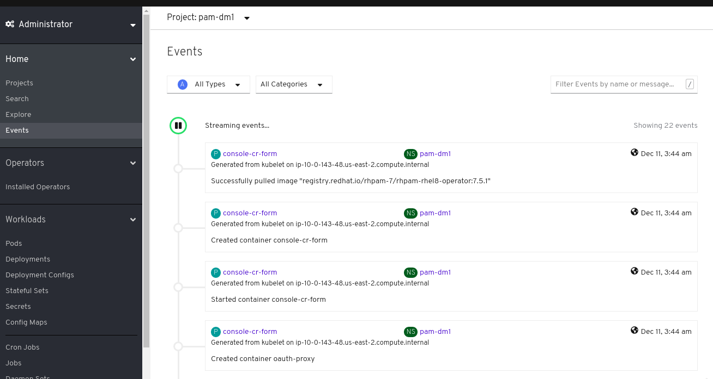
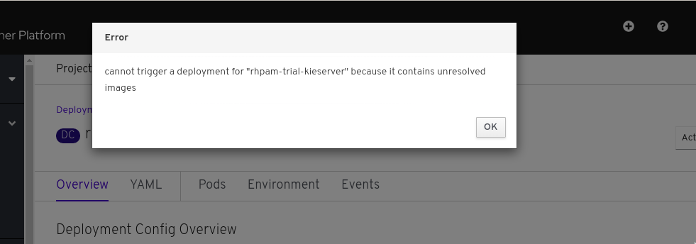
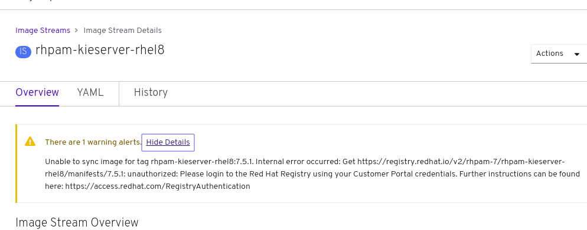
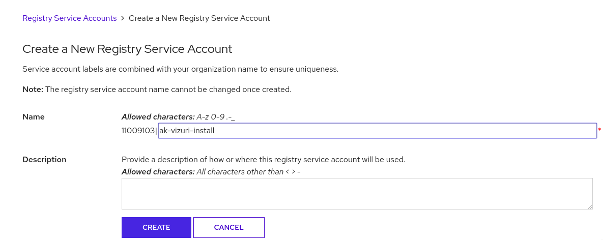

# Operator-driven installation troubleshooting

It turns out that the Deployment Configs that are responsible for rolling out the necessary pods are unable to create the necessary pods for the installation. The number of pods for both deployment configs continues staying at “0 of 1” and the installation is not proceeding. 

The first place to look is in the logs of the business automation operator: 

```json
[akochnev@localhost quarkus-kieserver-client]$ oc logs business-automation-operator-b76dd6478-8rdwq 
....
{"level":"info","ts":1576054074.2177753,"logger":"olm","msg":"Found deployments with status ","stopped":["rhpam-trial-kieserver","rhpam-trial-rhpamcentr"],"starting":[],"ready":[]}
{"level":"warn","ts":"2019-12-11T08:56:12.898941522Z","logger":"kieapp.controller","msg":"ImageStreamTag openshift/rhpam-businesscentral-rhel8:7.5.1 doesn't exist."}
{"level":"info","ts":"2019-12-11T08:56:12.898992875Z","logger":"kieapp.controller","msg":"Creating","kind":"ImageStreamTag","name":"rhpam-businesscentral-rhel8:7.5.1","from":"registry.redhat.io/rhpam-7/rhpam-businesscentral-rhel8:7.5.1","namespace":"pam-dm1"}
{"level":"warn","ts":"2019-12-11T08:56:12.925660605Z","logger":"kieapp.controller","msg":"ImageStreamTag openshift/rhpam-kieserver-rhel8:7.5.1 doesn't exist."}
{"level":"info","ts":"2019-12-11T08:56:12.925704094Z","logger":"kieapp.controller","msg":"Creating","kind":"ImageStreamTag","name":"rhpam-kieserver-rhel8:7.5.1","from":"registry.redhat.io/rhpam-7/rhpam-kieserver-rhel8:7.5.1","namespace":"pam-dm1"}
{"level":"info","ts":1576054572.9361641,"logger":"olm","msg":"Found deployments with status ","stopped":["rhpam-trial-kieserver","rhpam-trial-rhpamcentr"],"starting":[],"ready":[]}
{"level":"warn","ts":"2019-12-11T08:59:34.841821335Z","logger":"kieapp.controller","msg":"ImageStreamTag openshift/rhpam-businesscentral-rhel8:7.5.1 doesn't exist."}
{"level":"info","ts":"2019-12-11T08:59:34.841874957Z","logger":"kieapp.controller","msg":"Creating","kind":"ImageStreamTag","name":"rhpam-businesscentral-rhel8:7.5.1","from":"registry.redhat.io/rhpam-7/rhpam-businesscentral-rhel8:7.5.1","namespace":"pam-dm1"}
{"level":"warn","ts":"2019-12-11T08:59:34.864665726Z","logger":"kieapp.controller","msg":"ImageStreamTag openshift/rhpam-kieserver-rhel8:7.5.1 doesn't exist."}
{"level":"info","ts":"2019-12-11T08:59:34.864706887Z","logger":"kieapp.controller","msg":"Creating","kind":"ImageStreamTag","name":"rhpam-kieserver-rhel8:7.5.1","from":"registry.redhat.io/rhpam-7/rhpam-kieserver-rhel8:7.5.1","namespace":"pam-dm1"}
{"level":"info","ts":1576054774.8772945,"logger":"olm","msg":"Found deployments with status ","stopped":["rhpam-trial-kieserver","rhpam-trial-rhpamcentr"],"starting":[],"ready":[]}
.......
```

No errors here, the operator seems to be chugging along with no issues, yet nothing is deploying. 

Investigating the “Events” tabs on both the operator, on the Deployment Config and on the Project gives no hints as to why things are not progressing as expected. No errors anywhere : 



The best tip for what’s wrong comes if you tried to force the rollout of the Deployment Configs. Navigate to the Deployment Configs -> Click through the “rhpam-trial-kieserver” Deployment Config, and from the Right-side Actions dropdown choose to “Start Rollout” and you get the following error message: 



With this information, you can investigate the image stream, and voila ! Turns out that the cluster is unable to authenticate to the container registry so that it could pull the images that it needs. 



If you look at the yaml of the image stream, you will see the same complaint - it couldn’t import the image: 

```yaml
kind: ImageStream
apiVersion: image.openshift.io/v1
metadata:
 name: rhpam-kieserver-rhel8
 namespace: pam-dm1
 selfLink: >-
   /apis/image.openshift.io/v1/namespaces/pam-dm1/imagestreams/rhpam-kieserver-rhel8
 uid: e98c73cd-1bf2-11ea-8a25-0a580a800019
 resourceVersion: '23540'
 generation: 2
 creationTimestamp: '2019-12-11T08:47:50Z'
 annotations:
   openshift.io/image.dockerRepositoryCheck: '2019-12-11T08:47:50Z'
spec:
 lookupPolicy:
   local: false
 tags:
   - name: 7.5.1
     annotations: null
     from:
       kind: DockerImage
       name: 'registry.redhat.io/rhpam-7/rhpam-kieserver-rhel8:7.5.1'
     generation: 2
     importPolicy: {}
     referencePolicy:
       type: Local
status:
 dockerImageRepository: >-
   image-registry.openshift-image-registry.svc:5000/pam-dm1/rhpam-kieserver-rhel8
 tags:
   - tag: 7.5.1
     items: null
     conditions:
       - type: ImportSuccess
         status: 'False'
         lastTransitionTime: '2019-12-11T08:47:50Z'
         reason: InternalError
         message: >-
           Internal error occurred: Get
           https://registry.redhat.io/v2/rhpam-7/rhpam-kieserver-rhel8/manifests/7.5.1:
           unauthorized: Please login to the Red Hat Registry using your
           Customer Portal credentials. Further instructions can be found here:
           https://access.redhat.com/RegistryAuthentication
         generation: 2
```

In order to fix this issue we will need an account that can authenticate with the image registry and pull images, and configure that account in our project

1. Navigate to https://access.redhat.com/terms-based-registry/ , log in with your Red Hat account, and create a new Service Account. You do want to use a service account here (and not your own password), because you don’t want to put your own passwords into the cluster configuration: 


2. This process generates a weirdly looking username (e.g. “11009103|ak-vizuri-install “ in my case) and a token for authentication. Run the command below, substituting the token and your email 
```bash
oc create secret docker-registry vz-rhreg-secret --docker-server=registry.redhat.io --docker-username="99999|your-service-account-changeme" --docker-password="eyJh.....snipped...JuzTo0" --docker-email="your-email@redhat.com"
```

3. Add the secret to the default service account in your project so that it can use this secret for pulling from the registry

```bash
oc secrets link default vz-rhreg-secret --for=pull
```

4. Now, re-import the images on the command line
```bash
oc import-image rhpam-businesscentral-rhel8 --from=registry.redhat.io/rhpam-7/rhpam-businesscentral-rhel8 --all --confirm
imagestream.image.openshift.io/rhpam-businesscentral-rhel8 imported

Name:			rhpam-businesscentral-rhel8
Namespace:		pam-dm1
Created:		41 minutes ago
Labels:			<none>
Annotations:		openshift.io/image.dockerRepositoryCheck=2019-12-11T09:29:26Z
Image Repository:	image-registry.openshift-image-registry.svc:5000/pam-dm1/rhpam-businesscentral-rhel8
Image Lookup:		local=false
....  Snipped ... 
```

```bash
akochnev@localhost quarkus-kieserver-client]$ oc import-image rhpam-kieserver-rhel8 --from=registry.redhat.io/rhpam-7/rhpam-kieserver-rhel8 --all --confirm
imagestream.image.openshift.io/rhpam-kieserver-rhel8 imported

Name:			rhpam-kieserver-rhel8
Namespace:		pam-dm1
Created:		44 minutes ago
Labels:			<none>
Annotations:		openshift.io/image.dockerRepositoryCheck=2019-12-11T09:29:08Z
Image Repository:	image-registry.openshift-image-registry.svc:5000/pam-dm1/rhpam-kieserver-rhel8
Image Lookup:		local=false
Unique Images:		1
Tags:			2
… snipped … 

```

Now, if you go look at the pods, the products are happing spinning up pods and working : 


